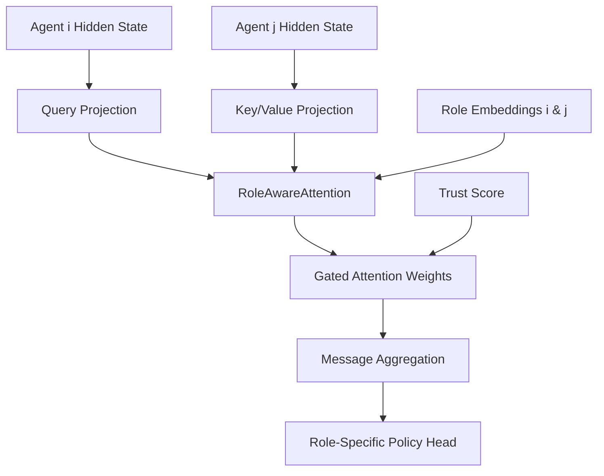
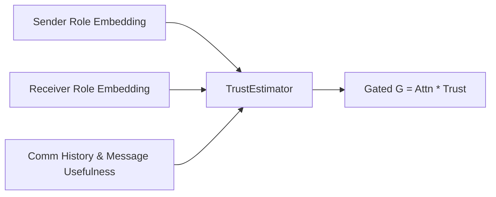

# Heterogeneous T2MAC (H-T2MAC)

This is a extension of the Target-Triggered Multi-Agent Communication (T2MAC) framework, transforming it from a homogeneous architecture (where agents share the same networks, encoders, and state sizes) into a **heterogeneous multi-agent communication framework**.

## Overview
In multi-agent reinforcement learning (MARL), especially complex micro-management environments like StarCraft Multi-Agent Challenge (SMAC), different unit types (e.g. Stalkers, Zealots, Medivacs, Marauders) have distinct roles. While homogeneous MARL models share all actor networks across agents to accelerate learning, they struggle when agents require different observation sizes, recurrent state capacities, policy structures, or communication gating behaviors.

H-T2MAC breaks the homogeneous parameter sharing assumption by giving agents distinct, role-based neural network banks and introducing learnable role embeddings. This allows Scout, Fighter, Medic, Tank, and Support units to specialize their encoders, memory (GRUs), and policies while maintaining a highly expressive, targeted communication system.

---

## Limit of Homogeneous T2MAC
1. **Identical Observations & Actions**: Forces all agents to share identical encoder and policy heads, which is incompatible with units that have distinct action spaces (e.g., Medivacs have a heal action, while Marines have attacks).
2. **Standard Attention**: Comm attention assumes query/key/value dimensions are uniform, preventing scale-diverse recurrent models.
3. **No Role Identity**: Communication does not distinguish sender/receiver identity, meaning a Medic cannot selectively weigh messages from an endangered Fighter versus a scouting unit.

---

## Architectural Differences

```
┌─────────────────────────────────────────────────────────────┐
│                       HOMOGENEOUS                           │
│  Agent i ──> Observation ──> Shared Encoder ──> Shared GRU  │
│  ──> Shared Comm Attention ──> Shared Policy Head           │
└─────────────────────────────────────────────────────────────┘
                             vs
┌─────────────────────────────────────────────────────────────┐
│                      HETEROGENEOUS                          │
│  Agent i ──> Observation ──> Role-Specific Encoder          │
│  ──> Role-Specific recurrent GRU ──> Role-Aware Attention   │
│  (using learnable role embeddings) ──> Role-Specific Policy │
└─────────────────────────────────────────────────────────────┘
```

---

## New Modules

1. **EncoderBank** (`src/modules/agents/role_encoder.py`):
   Contains an observation encoder mapping the environment observation to a role-specific hidden size.
2. **GRUBank** (`src/modules/agents/role_gru.py`):
   Maintains distinct role-specific recurrent layers (`nn.GRUCell`), allowing agents to have different memory state dimensions.
3. **PolicyHeadBank** (`src/modules/agents/role_policy.py`):
   Maintains role-specific linear projection heads to output discrete Q-values.
4. **RoleAwareAttention** (`src/modules/role_aware_attention.py`):
   Attention score computation conditioning on query, key, and sender/receiver learnable role embeddings:
   $$\text{Score}_{ij} = \text{MLP}(q_i, k_j, r_i, r_j)$$
5. **TrustEstimator** (`src/modules/trust_estimator.py`):
   Computes trust factors gating communication based on sender/receiver roles, communication history, and usefulness:
   $$T_{ij} = \text{Sigmoid}(\text{MLP}(r_i, r_j, H_{ij}, U_i))$$
6. **SMACRoleMapper** (`src/smac/role_mapper.py`):
   Translates StarCraft II unit type codes into discrete roles (e.g., Stalker -> Support, Zealot -> Tank).
7. **RoleMetricsLogger** (`role_metrics.py`):
   Tracks and writes role-wise reward, trust levels, and attention distribution to the `/logs` directory and plots them in `/plots`.

---

## Config Changes

Parameters in `src/config/algs/heterogeneous.yaml`:
- `heterogeneous`: Enables the heterogeneous modules.
- `num_roles`: Number of distinct roles.
- `role_names`: List of roles (`scout`, `fighter`, `medic`, `tank`, `support`).
- `roles`: Role configuration defining the `hidden_dim` for each role.
- `role_assignment_method`: Method to assign roles (`fixed`, `random`, or `unit_type`).
- `trust_enabled`: Toggles the TrustEstimator module.
- `role_attention_enabled`: Toggles RoleAwareAttention.

---

## Communication and Trust Flows

### Communication Flow


### Trust Flow


---

## Training and SMAC Usage

To start a heterogeneous training run on StarCraft II scenario `3s5z`:
```bash
python src/main.py --config=heterogeneous --env-config=sc2 with env_args.map_name=3s5z
```

Homogeneous mode is deprecated and has been completely removed from this repository.

---

## Ablation Recommendations
- **Ablate Trust Gating**: Disable `trust_enabled` in `heterogeneous.yaml` to measure the impact of dynamic trust estimation on noisy channel scenarios.
- **Ablate Role Attention**: Disable `role_attention_enabled` to revert to simple dot-product queries and keys without role contexts.
- **Ablate Variable Hidden State Size**: Set all roles to use a uniform 64-dimensional hidden layer to isolate the benefit of parameter factorization versus state capacity scaling.
